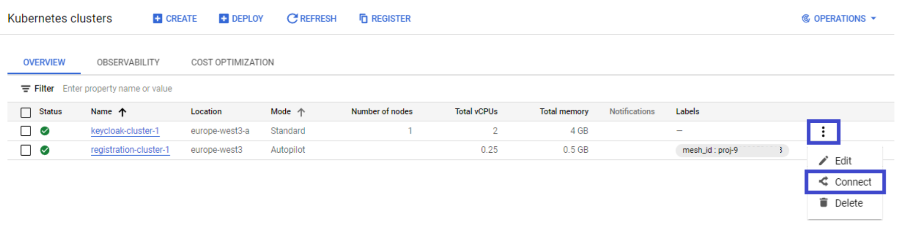
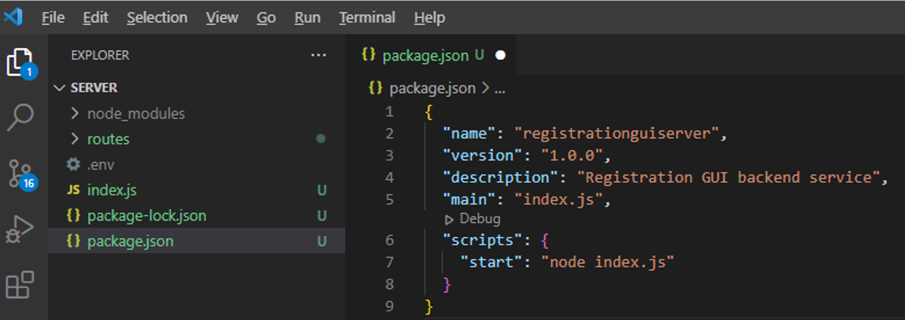
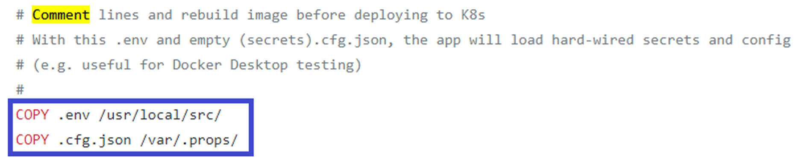

# Registration Sample application (React GUI and Node.js Backend) 

A simple application (demo premise: to capture prospective buyers' interest in new cars) comprising:
1. A basic web GUI (technology: React with Javascript) operating in conjunction with
2. A web backend service (technology: Node.js Express with Javascript)

This application uses KeyCloak to authenticate users so the first part details how to install KeyCloak both locally (when testing the application on a local desktop) and in the Cloud (i.e. hosted by K8s alongside the applications)

## 1 KeyCloak Local Set-up

KeyCloak is an opensource IAM (Identity and Access Management) platform compliant to OAuth2 and OIDC (Open ID Connect) standards

[KeyCloak](https://www.keycloak.org/getting-started/getting-started-docker)

KeyCloak is available both as:

- A standard image from Quay.io for Docker Desktop installation to support local desktop testing
- A Helm Chart which can install KeyCloak as a K8s-hosted service

KeyCloak is a pre-requisite to run/test both the Registration GUI and Backend sample applications which use it to manage secure user login/ authentication

### 1.1 Install / Start KeyCloak locally (Windows desktop)

From a Command Prompt:

`docker pull quay.io/keycloak/keycloak:21.1.1`<br/>
`docker run --rm --name keycloak -e KEYCLOAK_USER=admin -e KEYCLOAK_PASSWORD=<defaultpass> -p 8180:8180 -it quay.io/keycloak/keycloak -b 0.0.0.0 -Djboss.http.port=8180`<br/>

### 1.2 Log-in as Administrator (Windows desktop)

Open the admin console: http://localhost:8180

Click Administration Console:


### 1.3 Create a Realm

Hover over the 'Master' realm, enter Name as `registrationrealm` then click 'Create'


### 1.4 Create the 'Open ID Connect' Client

Click 'Clients' and 'Create'

Complete the form as follows:

| Form Field | Value |
| --- | ----------- |
| ClientID | registrationclient |
| Access Type | confidential |
| Client Protocol | openid-connect |
| Valid Redirect URIs | http://localhost:3001/oauth-callback |
| Backchannel Logout Session Required | OFF |

Note. KeyCloak will invoke the 'Valid Redirect URI' (i.e. the Registation App GUI Backend's OAuth-Callback route)

*Important.* On the 'Credentials' tab, take note of this OAuth client's 'secret'
This must appear in the Registration GUI's .env file (the 'clientSecret' environment setting)

Creating the Registration Backend service (which interacts with KeyCloak) is explained section 4 onwards

### 1.5 Create the test User

Click 'Users' and 'Add user'


Click 'Credentials' and enter the password (twice).

Ensure 'Temporary' is OFF

Click 'Set Password'

## 2 KeyCloak GCloud K8s-hosted Configuration

While the above steps are sufficient to install KeyCloak for local desktop testing, different configuration is needed manage/host a KeyCloak Cloud instance
 
KeyCloak is also available as a Helm Chart which can install the service on K8s

### 2.1 Prepare a Standard Cluster to host KeyCloak in GCP

First create a new Standard cluster (will reside alongside 'registration-cluster-1') called ‘keycloak-cluster-1’:


And finally:


### 2.2 Install / Start KeyCloak in GCloud K8s (using a Helmchart)

Open up GShell in the new (keycloak-cluster-1) cluster’s context:



In Cloud Shell:

`helm repo add bitnami-repo https://charts.bitnami.com/bitnami`<br/>
`helm repo list` reveals the bitnami-repo is now known to Helm<br/>
`helm install keycloak bitnami-repo/keycloak --set auth.adminUser=myadmin --set auth.adminPassword=myadmin --set tls.enabled=true --set tls.autoGenerated=true`<br/>

After a while a new Keycloak Stateful Set should appear in ‘OK’ running state:


The IP address of this new running Keycloak is visible under Services:


### 2.3 Test/ tune GCloud K8s-hosted Keycloak instance

Open a new browser tab at: https://<IP address for 'keycloak' service endpoint above> and on the KeyCloak landing page, click 'Administration Console'

*Important.* Accept the certificate when warned it is not trusted.

Now repeat steps 1.3 – 1.5

## 3 Application Repo set-up

### 3.1 Create an empty Repo (in GitHub)

Your repo can be Public or Private:


### 3.2 Copy Repo location to clipboard


### 3.3 Create the parent working folder

On the local Desktop (using the Command Prompt):

`cd %HOMEPATH%`</br>
`mkdir projects`</br>
`cd projects`

### 3.4 Clone the repo

`git clone <paste>` (i.e. URL copied into Clipboard from GitHub above)

## 4 Create the Backend service

`cd %HOMEPATH%\projects\registrationgui`<br/>
`mkdir server`<br/>

## 5 Develop the Backend service

### 5.1 Initialize Node.js configuration

`cd %HOMEPATH%\projects\registrationgui\server`<br/>
`code .` (will launch VS Code in the specific project folder)<br/>

Using VS Code's Terminal, create a package.json file:

`npm init`


Edit package.json to:
- Remove the 'test' script entry
- Add the 'start' script entry
- Remove the 'author' entry
- Remove the 'license' entry



### 5.2 Initial code and dependencies

Create the main file called index.js, the complete example is visible in Github:

[Index.js example](https://github.com/burningglass/registrationgui/blob/main/server/index.js)

Most important is declaring the imports (at the top of this file):
Amongst these are references to the following scripts (will reside under the 'routes' path) to handle user authentication, log-in and log-out:

`const userRoute = (require('./routes/user'));`<br/>
`const loginRoute = (require('./routes/login'));`<br/>
`const logoutRoute = (require('./routes/logout'));`<br/>
`const oauthCallbackRoute = (require('./routes/oauth-callback'));`<br/>

These other scripts (will also reside under 'routes') handle data access and form field input validation:

`const modelsRoute = (require('./routes/models'));`<br/>
`const coloursRoute = (require('./routes/colours'));`<br/>
`const registrationsRoute = (require('./routes/registrations'));`<br/>
`const validationErrorsRoute = (require('./routes/validationErrors'));`<br/>

Express is the major dependency:

[Express](https://expressjs.com/)

`const express = require('express');`

Also because this Backend server-side app may be reached on a port different to that of the (React)client-side app (e.g. both will listen for connections side-by-side on a local desktop) enabling 'CORS' is necessary:

`const cors = require('cors');`

Finally enabling 'dotenv' allows environment properties to be read from a local file (.env) - for purposes of local desktop development and testing:

`const dotenv = require('dotenv').config();`

### 5.3 Create the Lib (shared functions) script

Create the lib.js script - the complete example is available in GitHub:

[Lib.js](https://github.com/burningglass/registrationgui/blob/main/server/lib.js)

Note. The single shared function in this script enables look-up of runtime properties whilst hiding lookup implementation detail, i.e. certain properties may be loaded from the environment (non-secret properties) or a local file (secret properties or 'secrets'), the application merely needs to access each property by name

The local file carrying secrets is .cfg.json and the script will expect to find it in the folder /var/.props

### 5.4 Implement all 'routes' scripts

Create the routes sub-folder:

`cd %HOMEPATH%\projects\registrationgui\server`<br/>
`mkdir routes`<br/>
`cd routes`<br/>

Create the following files (note. fully implemented examples are available in this repo for reference):

[Colours.js](https://github.com/burningglass/registrationgui/blob/main/server/routes/colours.js)<br/>
[login.js](https://github.com/burningglass/registrationgui/blob/main/server/routes/login.js)<br/>
[logout.js](https://github.com/burningglass/registrationgui/blob/main/server/routes/logout.js)<br/>
[models.js](https://github.com/burningglass/registrationgui/blob/main/server/routes/models.js)<br/>
[oauth-callback.js](https://github.com/burningglass/registrationgui/blob/main/server/routes/oauth-callback.js)<br/>
[registrations.js](https://github.com/burningglass/registrationgui/blob/main/server/routes/registrations.js)<br/>
[user.js](https://github.com/burningglass/registrationgui/blob/main/server/routes/user.js)<br/>
[validationErrors.js](https://github.com/burningglass/registrationgui/blob/main/server/routes/validationErrors.js)

### 5.5 Create the Backend's environment file (runtime settings)

Under `%HOMEPATH%\projects\registrationgui\server`
Create a text file called `.env`

Contents should be as follows:

```
SVR_APP_LISTENING_PORT=3001

SVR_APP_GET_COLOURS_URI=http://localhost:5000/colours
SVR_APP_GET_MODELS_URI=http://localhost:5000/models
SVR_APP_GET_REGISTRATIONS_URI=http://localhost:5000/registrations
SVR_APP_GET_VALIDATIONERRORS_URI=http://localhost:5000/validationErrors

SVR_APP_FRONTENDGUI_LANDING_URI=http://localhost:3000

SVR_APP_AUTHSERVER_HOST=http://localhost:8180
SVR_APP_AUTHSERVER_CLIENT_ID=registrationclient
SVR_APP_AUTHSERVER_CLIENT_SECRET=<enter here the client secret created in KeyCloak>

SVR_APP_FRONTCHANNEL_LOGIN_PATH_PREFIX=/auth/realms/registrationrealm/protocol/openid-connect/auth?client_id=
SVR_APP_FRONTCHANNEL_LOGIN_PATH_SUFFIX=&response_type=code&state=

SVR_APP_REDIRECT_PATH=&redirect_uri=
SVR_APP_REDIRECT_URI=http://localhost:3001/oauth-callback

SVR_APP_FRONTCHANNEL_LOGOUT_PATH_PREFIX=/auth/realms/registrationrealm/protocol/openid-connect/logout?client_id=

SVR_APP_BACKCHANNEL_TOKEN_REQUEST_PATH=/auth/realms/registrationrealm/protocol/openid-connect/token
```

### 5.6 Install all Node.js packages

`cd %HOMEPATH%\projects\registrationgui\server`<br/>
`npm install express`<br/>
`npm install request`<br/>
`npm install crypto`<br/>
`npm install dotenv`<br/>
`npm install node-fetch@2` (...when using ESM3, else simply install node-fetch)<br/>
`npm install cors`<br/>
`npm install express-session`

### 5.7 Launch the Backend service

`cd %HOMEPATH%\projects\registrationgui\server`<br/>
`npm start`

### 5.8 Push all source and configuration back to GitHub

`cd %HOMEPATH%\projects\registrationgui\server`<br/>
`git add package.json`<br/>
`git add package-lock.json`<br/>
`git add index.js`<br/>
`git add routes\colours.js`<br/>
`git add routes\login.js`<br/>
`git add routes\logout.js`<br/>
`git add routes\models.js`<br/>
`git add routes\oauth-callback.js`<br/>
`git add routes\registrations.js`<br/>
`git add routes\user.js`<br/>
`git add routes\validationErrors.js`<br/>
`git commit -m "Initial bulk (server) code upload"`<br/>
`git push`

## 6 Develop the Frontend service

### 6.1 Initialize Node.js configuration

`cd %HOMEPATH%\projects\registrationgui`<br/>
`mkdir client`<br/>
`cd client`<br/>
`code .` (will launch VS Code in the specific project folder)

Using VS Code's Terminal, create a package.json file:
 npm init


Edit package.json to:

- Remove the 'test' script entry
- Add the 'start' entry: `"start": "react-scripts start"`
- Remove the 'author' entry
- Remove the 'license' entry

### 6.2 Initial code and dependencies

Create the main file called index.js:

`cd %HOMEPATH%\projects\registrationgui\client`<br/>
`mkdir src`<br/>
`cd src` and create the file (index.js) here

Note. the complete example is visible in Github:

[Index.js example](https://github.com/burningglass/registrationgui/blob/main/client/src/index.js)

### 6.3 Develop the single React component

Create the routes sub-folder:

`cd %HOMEPATH%\projects\registrationgui\client\src`<br/>
`mkdir components`<br/>
`cd components` and create the file (Greeting.js) here

[Greeting.js example](https://github.com/burningglass/registrationgui/blob/main/client/src/components/Greeting.js)

### 6.4 Create the Front-end's environment file (runtime settings)

`cd %HOMEPATH%\projects\registrationgui\client`<br/>
`edit .env`<br/>

Contents of the new .env file is as follows:

```
REACT_APP_LOGIN_URI=http://localhost:3001/login
REACT_APP_LOGOUT_URI=http://localhost:3001/logout

REACT_APP_GET_ACTIVEUSER_URI=http://localhost:3001/user
REACT_APP_GET_MODELS_URI=http://localhost:3001/models
REACT_APP_GET_COLOURS_URI=http://localhost:3001/colours
REACT_APP_GET_VALIDATION_ERRORS_URI=http://localhost:3001/validationerrors

REACT_APP_REGISTRATION_OPS_URI=http://localhost:3001/registrations
```

### 6.5 Install all Node.js packages

`cd %HOMEPATH%\projects\registrationgui\client`<br/>
`npm install react react-dom`<br/>
`npm install react-scripts`<br/>
`npm install web-vitals@2.1.4`<br/>
`npm install bootstrap@v5.2.2`<br/>

### 6.6 Complete package.json

Add 'eslintConfig' and 'browserslist' sections

The complete file should resemble:

```
{
  "name": "registrationguiclient",
  "version": "1.0.0",
  "description": "Registration GUI frontend (React)",
  "main": "index.js",
  "scripts": {
    "start": "react-scripts start"
  },
  "author": "",
  "license": "ISC",
  "dependencies": {
    "bootstrap": "^5.2.2",
    "react": "^18.2.0",
    "react-dom": "^18.2.0",
    "react-scripts": "^5.0.1",
    "web-vitals": "^2.1.4"
  },
  "eslintConfig": {
    "extends": [
      "react-app"
    ]
  },
  "browserslist": {
    "production": [
      ">0.2%",
      "not dead",
      "not op_mini all"
    ],
    "development": [
      "last 1 chrome version",
      "last 1 firefox version",
      "last 1 safari version"
    ]
  }
}
```

### 6.7 Create the default index.html (for app launch purposes)

`cd %HOMEPATH%\projects\registrationgui\client`<br/>
`mkdir public`<br/>
`cd public`<br/>

Create a new file called index.html with the following content:

```
<!DOCTYPE html>
<html lang="en">
  <head>
    <meta charset="utf-8" />
    <meta name="viewport" content="width=device-width, initial-scale=1" />
    <meta name="theme-color" content="#000000" />
    <meta
      name="description"
      content="Car Interest Registration (for registering customer interest in new cars)"
    />
    <title>Car Interest Registration</title>
  </head>
  <body>
    <noscript>You need to enable JavaScript to run this app.</noscript>
    <div id="root"></div>
  </body>
</html>
```

### 6.8 Create the main stylesheet

`cd %HOMEPATH%\projects\registrationgui\client\src`

Create a new file called App.css with the following content:

```
.App {
  text-align: center;
}
```

### 6.9 Launch the Frontend

`cd %HOMEPATH%\projects\registrationgui\client`<br/>
`npm start`

### 6.10 Push all source and configuration back to GitHub

`cd %HOMEPATH%\projects\registrationgui\client`<br/>
`git add package.json`<br/>
`git add package-lock.json`<br/>
`git add src\index.js`<br/>
`git add public\index.html`<br/>
`git add src\App.css`<br/>
`git add src\components\Greeting.js`<br/>
`git commit -m "Initial bulk (React frontend) code upload"`<br/>
`git push`

## 7 Dockerize the Frontend and Backend (in GCloud)

### 7.1 Connect to K8s context in GCloud:


### 7.2 Connect to the K8s cluster:


### 7.3 Create the parent working folder (GCloud Shell environment):

`cd ~`<br/>
`mkdir projects`<br/>
`cd projects`

### 7.4 Clone the Repo (from GitHub):

`git clone <paste>` (i.e. URL copied to clipboard in 1.2)

### 7.5 Temporarily amend Dockerfiles

To copy secrets into images (for initial local GCloud testing)
 
`cd ~/projects/registrationgui/server`

Edit the first Dockerfile and uncomment the two relevant COPY lines:



cd ~/projects/registrationgui/client`

Edit the second Dockerfile and uncomment the two relevant COPY lines:


### 7.6 Configure Docker in GCloud

`gcloud auth configure-docker`

### 7.7 Build the Docker images:

To retrieve the PROJECT_ID:

`gcloud projects list`

Issue these command (replacing [PROJECT_ID] first):

`cd ~/projects/registrationgui/server`<br/>
`docker build -t gcr.io/[PROJECT_ID]/registrationguiserver:v1.0.0 .`<br/>

To build the images using their respective Dockerfiles:

`cd ~/projects/registrationgui/client`<br/>
`docker build -t gcr.io/[PROJECT_ID]/registrationguiclient:v1.0.0 .`<br/>

Note. complete Dockerfiles are available here:

[Backend Dockerfile](https://github.com/burningglass/registrationgui/blob/main/server/Dockerfile)

[Frontend Dockerfile]
(https://github.com/burningglass/registrationgui/blob/main/client/Dockerfile)

### 7.8 Check the local (Docker) Registry

`docker image ls` reveals the newly-built images (above) showing their respective <image ids>

### 7.9 Start and verify service in GCloud Shell

The following commands create containers named "registrationguiservercontainer" and "registrationguiclientcontainer" and starts them:

`docker run -d -i -t -p:8881:443 --name registrationguiservercontainer <image id>`<br/>
`docker run -d -i -t -p:8882:443 --name registrationguiclientcontainer <image id>`<br/>

Check the containers are running:

`docker container ls`<br/>

Note. how these containers (i.e. instances of their images) are:

1. Running in the background
2. Show the host and port they are listening on
3. Identified by their respective unique container name

The following should reveal the containers listening outwardly on ports 8881 and 8882 respectively:

`netstat -a | grep 8881`<br/>
`netstat -a | grep 8882`

Traffic to each port will be routed inwardly to Nginx instances (nginx will be listening on port 443 inside the container)  

### 7.10 Terminal into each container

The following works against each container because they were started with the -i switch:

`docker exec -it <container name> /bin/bash`

Note. `-i -t` in the `docker run` above allocated a pseudo-TTY connected to the container’s stdin (pseudo-TTY: a device that has the functions of a physical terminal without actually being one; created by terminal emulators such as xterm)

Now whilst inside the container filesystem:

`ls`<br/> should list the primary folders:
- e.g. `/etc/nginx` comprises the embedded Nginx web server binaries and configs
- e.g. [in the server container] `/usr/local/src` contains the Node.js Express app scripts
- e.g. [in the client container] `/usr/share/nginx/html` contains the static/minified React app scripts

`exit` to exit out of the containers

### 7.11 Testing

It is not possible within the GShell to test the above, because both container images embedded self-signed certificates (which beaches GCloud security policy)

However it is possible to repeat step 7.3 to 7.9 on a Windows desktop with Docker installed

Then the above can be tested in a browser, e.g. requesting `https://<localhost>:8881/colours` will execute code in registrationguiserver, which will in turn execute registrationstore (which incidentally should already be started locally too) to access all available vehicle colours on offer

### 7.12 Clean up

Not strictly necessary because the GCloud Shell will clean up the workspace, but for learning purposes:

The following list all docker containers (both started and stopped), the two containers in this example shold carry status "Exited"

`docker container stop <container name>`<br/>
`docker container ls -a`

Assuming so, remove them and their respective images:

`docker container rm <container name>` to delete each container<br/>
`docker image rm <image id>` to delete each image<br/>

### 7.13 Prepare built images for Kubernetes deployment

Important: Images pushed to Google Container Registry and loaded by K8s must not contain secrets

Each image must therefore be adjusted and rebuilt:

`cd ~/projects/registrationgui/server`<br/>

Edit `Dockerfile` and uncomment the two relevant COPY lines:


`cd ~/projects/registrationgui/client`<br/>

Now edit this `Dockerfile` and uncomment the relevant COPY line:


### 7.14 Rebuild the images

To retrieve the PROJECT_ID:

`gcloud projects list`

Issue these command (replacing [PROJECT_ID] first) to rebuild the images (no longer carrying secrets):

`cd ~/projects/registrationgui/server`<br/>
`docker build -t gcr.io/[PROJECT_ID]/registrationguiserver:v1.0.0 .`

`cd ~/projects/registrationgui/client`
`docker build -t gcr.io/[PROJECT_ID]/registrationguiclient:v1.0.0 .`

### 7.15 Push the Docker images to the Google Container Repository

Again replace [PROJECT_ID] (see previous step):

`docker push gcr.io/[PROJECT_ID]/registrationguiserver:v1.0.0`<br/>
`docker push gcr.io/[PROJECT_ID]/registrationguiclient:v1.0.0`

## 8 Google Secrets Set-up (for Registrationgui)

### 8.1 Enable Secret Manager

If not already enabled, find this service under Security and 'Enable' it to reach this dialog:


### 8.2 Create all Secrets (and establish all IAM Policy Bindings)

In GCloud Shell create and run the following script (remembering to replace [PROJECT_ID] with the actual GCP Project ID where it is initially set, i.e. SET PROJECT_ID):

[Secrets setup script](https://github.com/burningglass/registrationgui/blob/main/server/grantSecretsAccessToServiceAccount.sh)

Refreshing Secret Manager should now reveal all the secrets now established, i.e.:
`SVR_APP_AUTHSERVER_HOST`<br/>
`SVR_APP_AUTHSERVER_CLIENT_ID`<br/>
`SVR_APP_AUTHSERVER_CLIENT_SECRET`<br/>
`SVR_APP_FRONTCHANNEL_LOGIN_PATH_PREFIX`<br/>
`SVR_APP_FRONTCHANNEL_LOGIN_PATH_SUFFIX`<br/>
`SVR_APP_REDIRECT_PATH`<br/>
`SVR_APP_REDIRECT_URI`<br/>
`SVR_APP_FRONTCHANNEL_LOGOUT_PATH_PREFIX`<br/>
`SVR_APP_BACKCHANNEL_TOKEN_REQUEST_PATH`

### 8.3 Modify secrets to reference K8s-hosted KeyCloak

The `grantSecretsAccessToServiceAccount.sh` script sets some ‘http’ and ‘localhost’ default values which require amendment so the RegistrationGUI Frontend and Backend can each reference the KeyCloak instance hosted in K8s (see section 2.2)

Change these values in GCloud's Secret Manager as follows:

From:
`SVR_APP_AUTHSERVER_HOST= http://localhost:8180`<br/>

To: 
`SVR_APP_AUTHSERVER_HOST=https://<keyCloakListeningIpAddress>`

From:
`SVR_APP_AUTHSERVER_CLIENT_SECRET= oidcsecret`<br/>

To: 
`SVR_APP_AUTHSERVER_CLIENT_SECRET=<SecretSpecifiedDuringKeyAdminSetup>`

From:
`SVR_APP_REDIRECT_URI=http://localhost:3001/oauth-callback`<br/>

To: 
`SVR_APP_REDIRECT_URI=https://<registrationguiserverSvcIpAddress – see below>/oauth-callback`

## 9 Deploy Registrationgui Frontend and Backend to K8s (in GCloud)

### 9.1 Reconnect to K8s context in GCloud:


### 9.2 Reconnect to the K8s cluster:


### 9.3 Create the Backend 'Deployment' configuration (as .yaml)

Create this new file in the registrationgui project’s ‘server’ sub-folder

The complete example is available in Github:

[Backend Deployment.yaml](https://github.com/burningglass/registrationgui/blob/main/server/Deployment.yaml

As with the registrationstore service, this Deployment will invoke an init container at startup to create a run-time settings file in the following memory-mounted folder (inside the Pod): 

`/var/.props/.cfg`<br/>

This .cfg will carry relevant secrets (established in section 8)

The second part of the Deployment.yaml describes the main application container which launches the registrationstoreguiserver Node.js Express app (from its Docker image in Google Container Registry)

### 9.3 Create the Frontend 'Deployment' configuration (as .yaml)

Create this new file in the registrationgui project’s ‘client’ sub-folder

The complete example is available in Github:

[Frontend Deployment.yaml](https://github.com/burningglass/registrationgui/blob/main/client/Deployment.yaml)

As with other services, this Deployment will invoke an init container at startup to create a run-time settings file in the following memory-mounted folder (inside the Pod):

`/var/.props/.cfg`<br/>

This .cfg will carry relevant secrets (established in section 8)

The second part of the Deployment.yaml describes the main application container which launches the registrationstoreguiclient Node.js React app (from its Docker image in Google Container Registry)

### 9.4 Create the 'Service' configuration as .yaml

Add the following new Service.yaml to the 'server' subfolder in the registrationgui project:

```
apiVersion: v1
kind: Service
metadata:
  name: registrationguiserversvc
spec:
  ports:
  - name: https
    port: 443
    targetPort: 443
  selector:
    app: registrationguiserver:
  type: LoadBalancer
```

Add the following new Service.yaml to the 'client' subfolder in the registrationgui project:

```
apiVersion: v1
kind: Service
metadata:
  name: registrationguiclientsvc
spec:
  ports:
  - name: https
    port: 443
    targetPort: 443
  selector:
    app: registrationguiclient:
  type: LoadBalancer
```

### 9.5 Commit and Push the new files to GitHub

`cd ~/projects/registrationgui/server`<br/>
`git add Deployment.yaml`<br/>
`git add Service.yaml`<br/>

`cd ~/projects/registrationgui/client`<br/>
`git add Deployment.yaml`<br/>
`git add Service.yaml`<br/>

`git commit -m “K8S installation/config artefacts”`<br/>
`git push`

### 9.6 Git Pull the two files (above) into local GShell ~/projects/registrationgui folder

`cd ~/projects/registrationgui`<br/>
`git pull`

### 9.10 Modify both Deployment.yamls and replace PROJECT_ID placeholders

To retrieve the PROJECT_ID:

`gcloud projects list`

`cd ~/projects/registrationgui/server`<br/>
`nano Deployment.yaml`<br/>

Replace the value “PROJECT_ID” under `env: -name: PROJECT_ID`<br/>
Replace the value “PROJECT_ID” within the image reference: `image: gcr.io/PROJECT_ID/registrationguiserver:v1.0.0`

`cd ~/projects/registrationgui/client`<br/>
`nano Deployment.yaml`<br/>

Replace the value “PROJECT_ID” under `env: -name: PROJECT_ID`<br/>
Replace the value “PROJECT_ID” within the image reference: `image: gcr.io/PROJECT_ID/registrationguiclient:v1.0.0`

### 9.11 Install Deployment.yaml into K8s (in GCloud):

`cd ~/projects/registrationgui/server`<br/>
`kubectl apply -f Deployment.yaml -n default`<br/>

`cd ~/projects/registrationgui/client`<br/>
`kubectl apply -f Deployment.yaml -n default`<br/>

`kubectl get pods -n default`<br/>

Note. `-n` specifies the K8s namespace (it's optional)

Each Deployment will create a single Pod instance (initially in 'ContainerCreating' state and eventually hit 'Running' state)

### 9.12 Install Service.yamls into K8s (in GCloud)

`cd ~/projects/registrationgui/server`<br/>
`kubectl apply -f Service.yaml -n default`<br/>

`cd ~/projects/registrationgui/client`<br/>
`kubectl apply -f Service.yaml -n default`<br/>

`kubectl get services -n default`<br/>

Note. `-n` specifies the K8s namespace (it's optional)

The above will create LoadBalancers for each service (initially in '<pending>' state and eventually showing the EXTERNAL-IPs each service is listening on, these LoadBalancers will direct all traffic to the respective Pods above)

### 9.13 Test the application now running on K8s (in GCloud)

`curl https://[EXTERNAL-IP(for Registrationgui Server/ see above)]/colours`<br/>
`curl https://[EXTERNAL-IP(for Registrationgui Client/ see above)]`


# Registration Web App
React app (front-end with back-end) to capture and display car interest registrations

## H2

### H3

**bold text**
*italicized text*
> blockquote

Ordered List:

1. First item
2. Second item
3. Third item

Unordered List:

- First item
- Second item
- Third item

`code`

Fenced Code Block:

```
{
  "firstName": "John",
  "lastName": "Smith",
  "age": 25
}
```

Horizontal Rule:

---

Table:

| Syntax | Description |
| ----------- | ----------- |
| Header | Title |
| Paragraph | Text |

Link:

[title](https://www.example.com)

Image:

